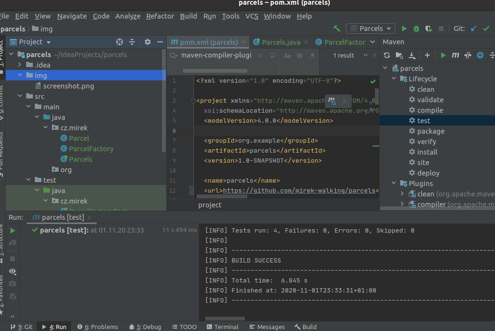

# Parcels
> HOMEWORK FOR BACKEND DEVELOPER POSITION IN BSC

## Table of contents
* [General info](#general-info)
* [Screenshots](#screenshots)
* [Technologies](#technologies)
* [Example  of usage](#example-of-usage)
* [Features](#features)
* [Status](#status)
* [Inspiration](#inspiration)
* [Contact](#contact)

## General info
HOMEWORK

## Screenshots

## Technologies
* Java
* Maven

## Example of usage
* in the project directory:
  * prepare the project    
    * `mvn install` 
  * run the project    
    * `mvn exec:java -Dexec.mainClass=cz.mirek.Parcels`

## Features
- read user input from console, user enters line consisting of weight of package and destination postal code

- once per minute - write output to console, each line consists of postal code and total weight of all packages for that postal code

- process user command “quit”, when user enters quit to command line as input, program should exit

- take and process command line argument specified at program run – filename of file containing lines in same format as user can enter in command line. This is considered as initial load of package information. (not implemented yet)

- handle invalid input of user (if some line of the input is invalid, the line will be ignored and user can insert next line)

Sample input:

3.4 08801

2 90005

12.56 08801

5.5 08079

3.2 09300

Input line format:

<weight: positive number, >0, maximal 3 decimal places, . (dot) as decimal separator><space><postal code: fixed 5 digits>

Sample output (order by total weight):

08801 15.960

08079 5.500

09300 3.200

90005 2.000

Output line format:

<postal code: fixed 5 digits><space><total weight: fixed 3 decimal places, . (dot) as decimal separator>

## Status
Only _for example usage_

## Inspiration
HOMEWORK FOR BACKEND DEVELOPER POSITION IN BSC

## Contact
Created by [mirek](mailto:mirek.321@gmail.com)